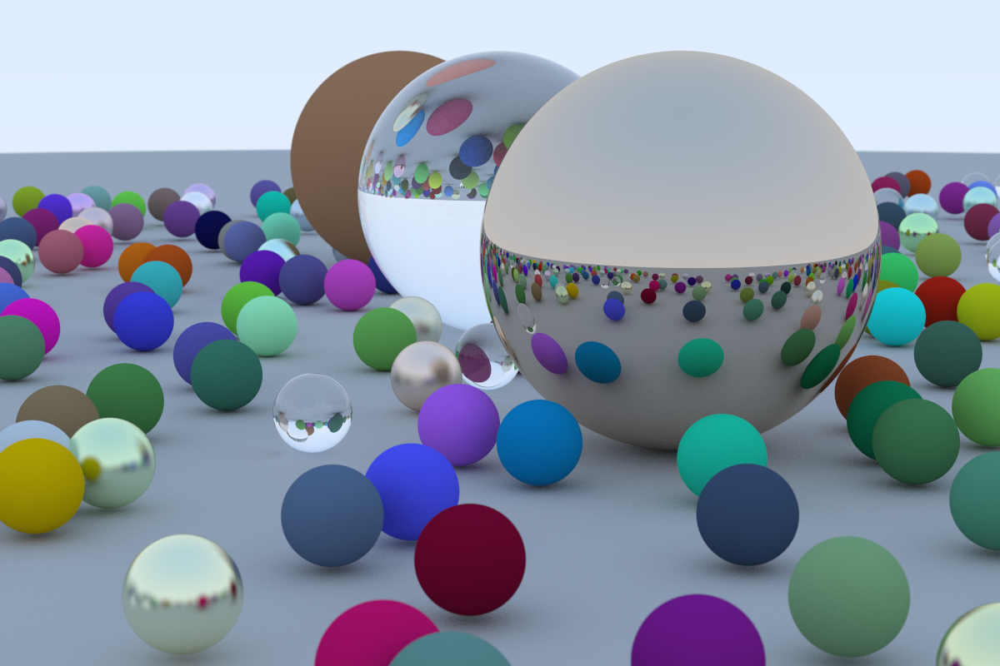
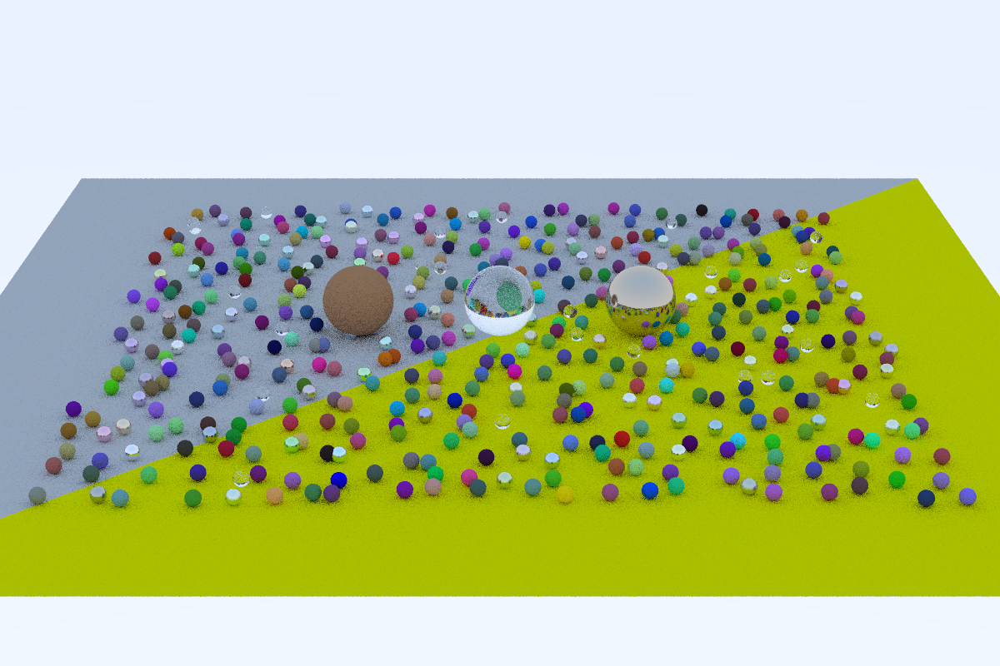
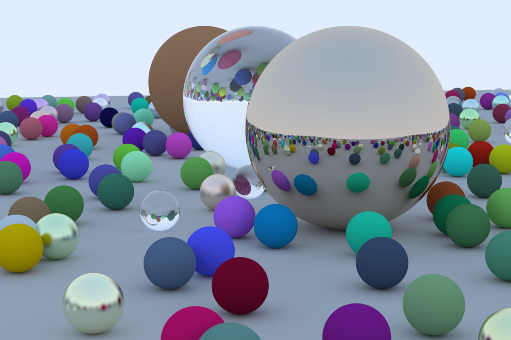

# raytracing
C++ implementation of the ray tracer descibed in [Ray Tracing in One Weekend](https://raytracing.github.io/books/RayTracingInOneWeekend.html) book by Peter Shirley.

## Resulting image

### Adding triangles
Support for trianges was added instead of using a sphere as the ground plane  
In this image one triangle is colored differently for visualisation purposes:

The final render with triangles is pretty much identical to what it was before:

