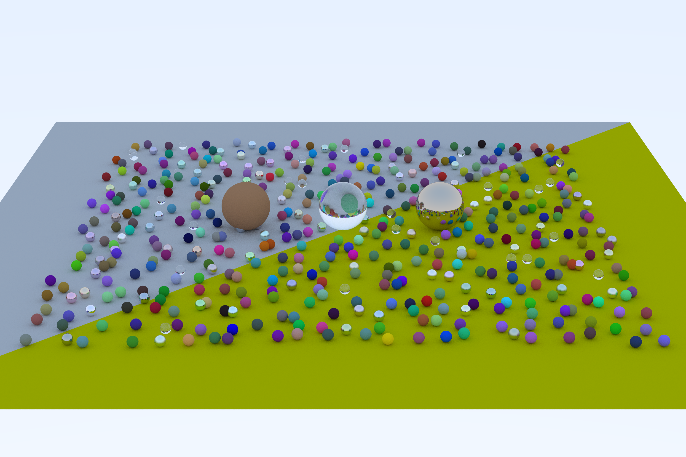
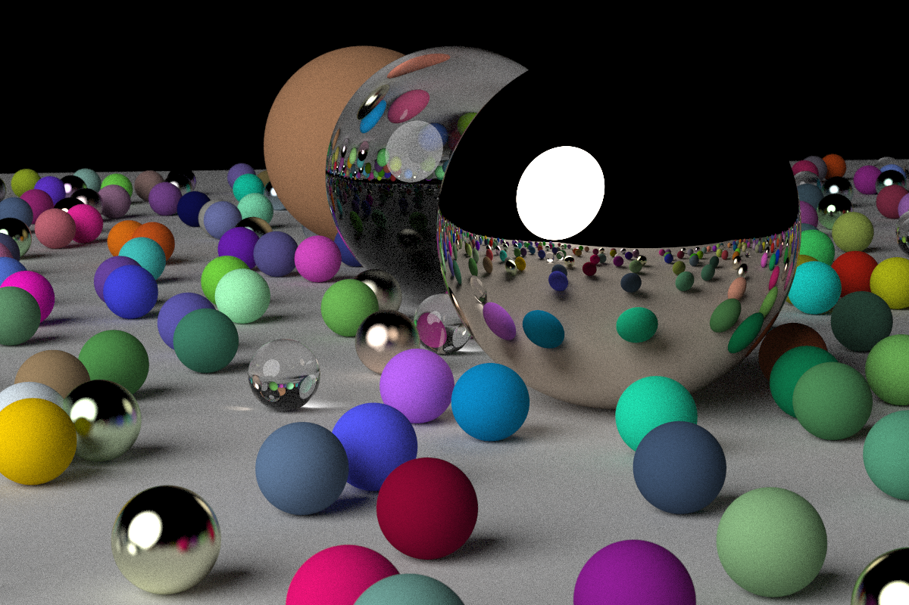
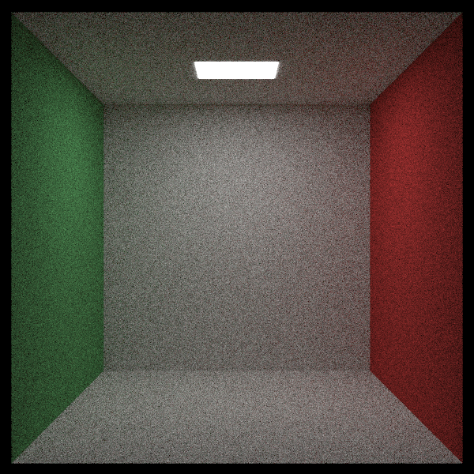

# raytracing
C++ implementation of the ray tracer descibed in the books by Peter Shirley ([_Ray Tracing in One Weekend_](https://raytracing.github.io/books/RayTracingInOneWeekend.html), [_Ray Tracing: The Next Week_](https://raytracing.github.io/books/RayTracingTheNextWeek.html), and [_Ray Tracing: The Rest of Your Life_](https://raytracing.github.io/books/RayTracingTheRestOfYourLife.html)).  
Some modifications have been made to make the code fit my own prefered style, but functionality-wise, the implementation is pretty much as described in the books (work in progress, but in some time).

## Sample images

### Triangles
Support for trianges was added instead of using a sphere as the ground plane.  
In this image two triangles form the gorund plane. One is colored differently to visualise the triangles:  

### Focus blur
These images show the effect of changing the aperture of the camera. The images were rendered with apertures 0.01, 0.1, 0.5 and 2.0:  

  

### Emissive materials
Below, the background was set to black and an emissive sphere was added as a light source:  

Here is an image depicting the Cornell box:  

